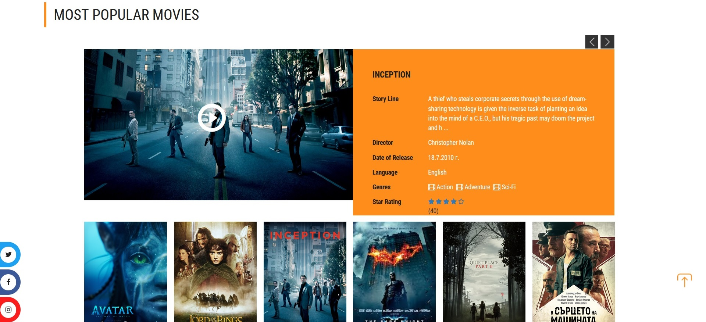

# ASP.NET Core Movie Website

## :point_right: Project Introduction :point_left:

**Movie Site** is a ready-to-use ASP.NET Core application.

Cinema World is an ASP.NET Core application providing a modern user interface for managing movies. The application features:

- **Navigation**: Home, Movies, Genres, News, Schedule.
- **Search**: Global search bar and footer links.
- **User Interaction**: Ratings, comments, and social media integration.
- **Pages**: Home, Movies, Genres, News, Schedule, FAQ, Contact Us.
- **Admin Panel**: User management and system updates.
- **User Profiles**: Managed via ASP.NET Core Identity.
- **Additional Features**: Facebook login, email subscriptions, and movie bookings.

## Technologies Used

- ASP.NET Core MVC
- ASP.NET Core areas
- Entity Framework Core
- Cloudinary
- SendGrid
- HtmlSanitizer
- Bootstrap
- JavaScript and JS animations
- jQuery
- Ajax

## :floppy_disk: Database Diagram

## Screenshots

### Home page

### Login/Register Dialog

### Footer

### Movies page

### Genres page

### News page

### Schedule page

### Book ticket page

### Admin Dashboard

## :v: Show your opinion
Give a :star: if you like this project!
